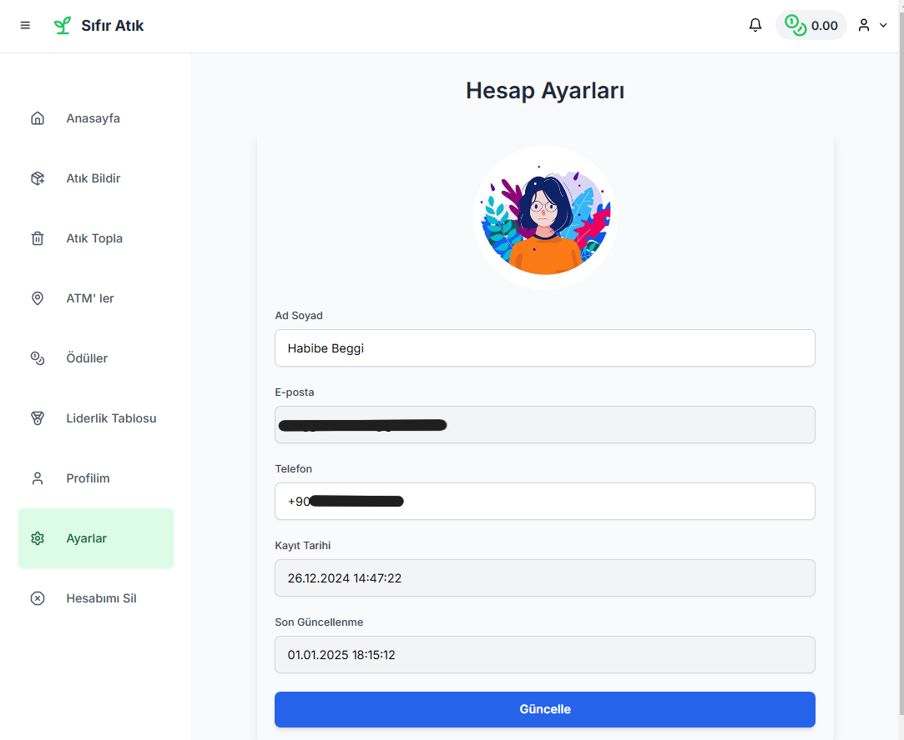

# The .env file should contain the following: 
"
NEXT_PUBLIC_DATABASE_URL
NEXT_PUBLIC_GEMINI_API_KEY 
NEXT_PUBLIC_WEB3AUTH_CLIENT_ID
NEXT_PUBLIC_GOOGLE_MAPS_API_KEY
"
# Project outputs are below:

Database diagram:  

  

Login/register with Web3Auth:  

  

Homepage:  
  

  

Reports:  

  

Collect:  

  

ATM (Waste Collection Centers):  

  

Rewards:  

  

Leaderboard:  

  

Profile:  

  

Settings:  

  

Delete Account:  

